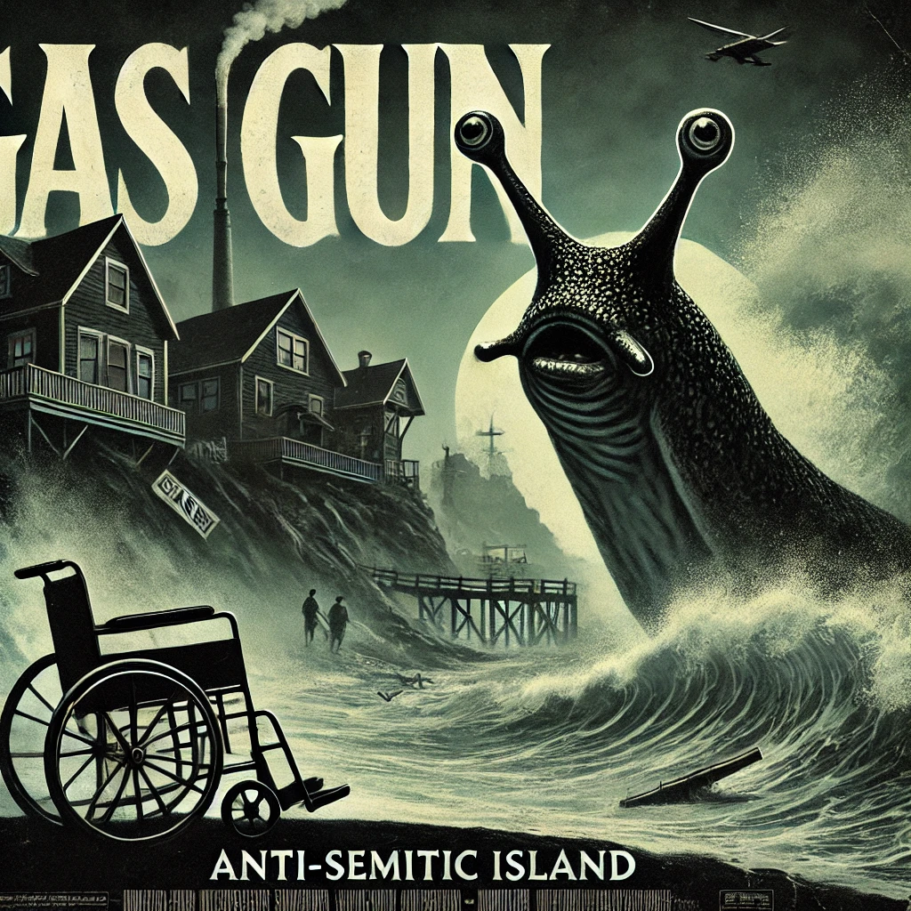

                            .__                             __
      _____    ____  ___  __|__|  ____      ____  ______  _/  |_
     /     \  /  _ \ \  \/ /|  |_/ __ \    / ___\ \____ \ \   __\
    |  Y Y  \(  <_> ) \   / |  |\  ___/   / /_/  >|  |_> > |  |
    |__|_|  / \____/   \_/  |__| \___  >  \___  / |   __/  |__|
          \/                         \/  /_____/  |__|


This project is inspired by [Andrej Karpathy's tutorial](https://www.youtube.com/watch?v=kCc8FmEb1nY) on building a GPT model from scratch. The goal is to scale the initial idea given by the tutorial and achieve better text generations with different datasets. 

We will use a really diverse dataset with bunch of movie names and descriptions for each movie. So after the training we will be able to generate a brand new description(hopefully) for a given movie title!

This model does not have a special tokenizer like other LLMs. We just encode every character to an integer. So it's a really simple implementation but even scaling this idea can lead to really impressing results.

I also added a custom training data option to train your own model with your own training data. So possibilities are endless here. You can even try to train the next GPT model by just changing a few hyperparamater values and also the dataset(if you have the computing power to do so). Obviously not having a proper subword tokenizer will be a big bottleneck for that. Or you can just explore the capabilities of the model by using any other simple dataset like mine.

I also added the `simple_bigram.py` file in the repo. It's really important to understand this simple model first before trying to understand the GPT model.

## Dataset
In the tutorial, [the tiny Shakespeare dataset](https://raw.githubusercontent.com/karpathy/char-rnn/master/data/tinyshakespeare/input.txt) was used. It's a really tiny dataset considering the size of data that's used in the training of today's LLMs. I decided to use something more interesting and bigger than this one.

I found this [Letterboxd dataset](https://www.kaggle.com/datasets/gsimonx37/letterboxd) from Kaggle. It had around 930k movies. By using the each movie's name and description, i though i could train a model to generate new movies (obv not full movies yet, just descriptions).

I just used the `movies.csv` file from the dataset. With `extractor.py`, I extracted the content of the name and the description column to `movie_descriptions.txt` file in this format:

```
The description of the movie named '<MovieTitle>' is:
<MoviePlot>
END_OF_MOVIE
```

I thought this would help the model a lot to understand the pattern of the training data, so by just giving the model a new movie title it could generate a  brand new movie description by just trying to complete the format it's trained on. I thought i could achieve really interesting results.

I couldn't upload the whole dataset to Github, so if you want to train the model with the dataset again you will have to get it from Kaggle. Then you can use the `extractor.py` to quickly extract the content in a structured manner. If you just want to start a quick run, i uploaded the `movie_descriptions_small.txt` to dataset folder. It has only 100000 movies for quick testing purposes.

## Model Architecture
I scaled up the model from the tutorial to get better results. Interestingly once you understand the logic behind a GPT model, you kind of understand that just scaling it with more data and more computing power will naturally lead to better results. So initially i wanted my model to have the same number of parameters as GPT-1 but even trying to implement this old model was really challenging considering the computing power that i have. So the end model ended up having more than half of the parameters that GPT-1 had. So let's explain the specifications of my model in detail:
- `n_embd`: Embedding dimensions. It represents the size of the each vector to encode each token. More dimensions will enable us to encode the meaning of each token more in depth. I used the value of 768 for this which is the same as GPT-1.
- `n_head`: Number of the heads of each attention layer. Different heads will enable the model to learn different aspects of the same input. I used the value of 8 for this which is less than 12, the value that was used in GPT-1.
- `n_layer`: Number of the attention layers. It represents how many layers of attention are stacked on top of each other. More of it will lead to deeper general understanding of the given text. Again i used 8 for this which is less than 12 layers of GPT-1.

The only reason i chose these values because i didn't have enough VRAM to increase them. The more you increase these values, the more accurate your model will be.

## Training
I trained the model on an RTX A5000 for 50 epochs which was around 53 hours. I used the default values of the parameters.

## Results
After playing with the model and checking the results i can say that the generating a movie from a title part is not really working great. I found out that expecting the model to generate a meaningful movie just from the `The description of the movie named '' is:` text is not really realistic. But if we just let the model complete the text that we give for a long time, it generates some interesting results like the ones below. I didn't give the title of each example below, the model just came up with the title and the description while generating new tokens.

Some really incredible results are(Posters are generated by DALL-E 3 to make them look cooler):

### Pulitzer


A recently released former Columnist arrested on 18 November 1972. He goes on a summer trip to America. At his elementary school he's obsessed with the reality of burying his dreams and meanings. After so many experiences of suffering anxiety, he demonstrates one diagnosis of need, determination, and self-proclaimed 'usual' desire, that he imperfectly makes decisions that will result in ready to propel the body earth back to 2022. Although fragmented images are juxtaposed when a woman reflects on the discovery of a recently discovered lake in her new home.

### Smell


A psychedelic Hollywood 1968 drama that explores the city of Italy and the death dystopics in France. Following a weekend held hostage in 1978 at BCHD location, a bus trap center severs are on freelance across a business pursuit of the trading agency.

### Gas Gun



When a slug finds himself running away on an anti-semitic island in a mysterious coastal town, he finds himself later in a major period inhuman wheelchair.


### In Wake Of The Labyrinth Eye


In Wake Of The Labyrinth Eye follows 38 forms of time passing yet gritty experience: the journey they talked about at the past, their love of amnesia. Twenty years after the disappearance, a painting of Visions Crossings lost near Patagonia, his land is filled with Space imagined poetic suspense and a timely exploration of the intimate lives of black and fishermen at the top.

### Paul Azala, the Enemy Embit and The Legend


Presents, the nearly annual film festival in nearly 200 countries centres around the most watchful work of a serial killer. With interviews and lectures, this documentary presents the five psychological and ethical questions in the city, sharing the sagas as well as the soldiers (such as the "Ultrainenbaumer Ludwig"), who, years after 20 murders, came into history and looked back at Andrek Iteyasov, including shady international aid  and rewriting the poem "Josefiliedt" by Ben Richmond. "Intelligent Poetry" features some bits of "Muzafire".  "Consolations"  "Josefiniedt" is a film dibrecting the entry of Andrek Iteyasov's experience while a moment of resilience  reflects the conflict under the commitment to Poetry.

### Just Another Safe


In a remote rural region north of Ukraine, two young women decide to cruise to open a runway along a woodswitch named The Safe. As they are going to find a band they play hard both days later and night, one of them embarks on a roadboard digging their own game scene.

These are some of the interesting ones. Some of them are from the last checkpoint and some of them are generated from the checkpoint at a 25th epoch. There's a lot of hallucinations too. I added the sample outputs to the outputs folder.


## Command Line Arguments
The following command line arguments can be used to customize the training and evaluation of the MovieGPT model. Each argument provides flexibility to adjust model hyperparameters, paths, and training configurations.

- `--checkpoint` (str, default=None)
  - Path to the checkpoint file to generate outputs. You cannot resume training from the checkpoint, you can only use your checkpoint to get an inference

- `--training_data` (str, default='dataset/movie_descriptions.txt')
  - Path to the training data file containing the movie descriptions.
  - You can use any training data you want to test out the model's capabilities.

- `--batch_size` (int, default=128)
  - Batch size for training, representing how many independent sequences will be processed in parallel.

- `--context_length` (int, default=256)
  - Length of the context (number of tokens) the model uses for predictions. This defines how much of the past information the model can see.

- `--eval_iters` (int, default=100)
  - Number of iterations to use for evaluation of the model's loss during training.

- `--lr` (float, default=2.5e-4)
  - Learning rate for the optimizer, controlling how much the model's weights are updated at each step.

- `--n_embd` (int, default=768)
  - Number of dimensions for the embeddings. This defines the size of the vector representation for each token.

- `--n_head` (int, default=8)
  - Number of heads in each attention block. More heads allow the model to capture multiple relationships between tokens in parallel.

- `--n_layer` (int, default=8)
  - Number of transformer layers in the model, which determines the depth of the model and how well it can capture complex relationships.

- `--dropout` (float, default=0.3)
  - Dropout rate used to prevent overfitting by randomly dropping units during training.

- `--max_new_tokens` (int, default=500)
  - Maximum number of new tokens to generate when using the model for text generation.

- `--seed` (int, default=7331)
  - Seed for reproducibility to ensure consistent results across different runs.

- `--device` (str, default='cuda')
  - Device to use for training, e.g., `'cuda'` for GPU or `'cpu'` for running on CPU.

- `--temperature` (float, default=1.0)
  - Temperature parameter for sampling during text generation. A higher value increases randomness in generated text, while a lower value makes it more deterministic. It should be bigger than 0 and less than 2.

- `--top_k` (int, default=None)
  - The number of top tokens to consider during sampling for text generation. It helps in controlling the randomness of generated text.

- `--logging_steps` (int, default=50)
  - Number of steps between each logging of training progress to Weights & Biases (wandb).

- `--epochs` (int, default=5)
  - Number of complete passes through the training dataset during training.

- `--disable-typewriter` (boolean, default=False)
  - Disables the typewriter effect printing of the generated output.


## How to Use It
**Clone the Repository**
   ```bash
   git clone https://github.com/UfukTanriverdi8/MovieGPT.git
   cd MovieGPT
   ```
   
**Create a Virtual Environment and Install Dependencies**
   ```bash
   python -m venv moviegpt-venv
    source moviegpt-venv/bin/activate  # On Windows use `moviegpt-venv\Scripts\activate`
   pip install -r requirements.txt
   ```

Now you can train it with your own model or get an inference from the pretrained model.


**Get an Inference**

- You can download the pretrained weights from [this Google Drive link](https://drive.google.com/file/d/1ccvjv6ov0K437G8McqparPrf4jf8nuoB/view?usp=sharing) or you can just use `gdown`:
```bash
gdown https://drive.google.com/uc?id=1ccvjv6ov0K437G8McqparPrf4jf8nuoB
```
- You can generate new movies by specifying a checkpoint file.
```bash
python gpt.py --checkpoint=path_to_checkpoint_file --device=cuda
```
or if you don't have a gpu
```bash
python gpt.py --checkpoint=path_to_checkpoint_file --device=cpu
```
The generated text will be printed and saved to the outputs folder.

**Train your own model**

You can train your own model by just specifying a new training data path.
```bash
python gpt.py --training_data=path_to_data_file
```
You can customize the hyperparameters as you like by using the command line arguments as explained above.